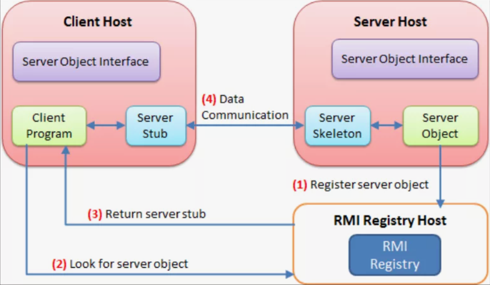

## go-rmi (remote method invocation)

Очень частым явлением является использование [RPC](https://en.wikipedia.org/wiki/Remote_procedure_call) технологии в
различных приложениях. Например, известный многим [gRPC](https://ru.wikipedia.org/wiki/GRPC), [Java RMI](https://ru.wikipedia.org/wiki/RMI),
который позволяет иметь несколько JVM с распределенной сборкой мусора.



В любом RPC нужно учитывать транспортный уровень, а также протокол сериализации данных,
например, в gRPC используется protobuf.

В этом домашнем задании вам предлагается, используя механизмы рефлексии Go, разработать свой RPC на основе http, используя JSON в качестве протокола сериализации

### Client
```
Invoke(ctx context.Context, url *url.URL, rmiMethod string, data []any, response any) error
```

`Invoke` делает запрос на указанный адрес, передавая в body сериализованный запрос (список аргументов), после
чего возвращает ответ через указатель

Вызов `Invoke` внешне ни чем не отличается от вызова обычной функции, что и является преимуществом RPC 

### Server
```
CreateObjectSkeleton(serverObject any) http.HandlerFunc
```
serverObject - структура, в которой определены нужные RPC методы

`CreateObjectSkeleton` создает так называемый Skeleton, предоставляющий связь между
транспортным уровнем и методами сервера